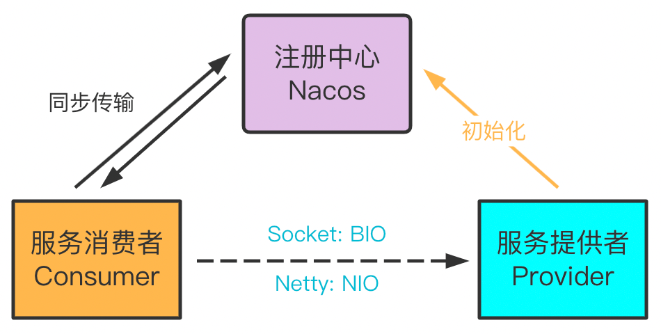

# My_RPC_Nacos
本项目是基于 Nacos 实现的RPC 框架。

## 架构



## 特性

- 实现了基于 Java 原生 Socket 传输与 Netty 传输两种网络传输方式
- 实现了四种序列化算法，Json 方式、Kryo 算法、Hessian 算法与 Google Protobuf 方式
- 实现了两种负载均衡算法：随机算法与轮转算法
- 使用 Nacos 作为注册中心，管理服务提供者信息
- 消费端如采用 Netty 方式，会复用 Channel 避免多次连接
- 接口抽象良好，模块耦合度低，网络传输、序列化器、负载均衡算法可配置
- 服务提供侧自动注册服务, 在实现类上添加@Service即可自动注册

## 项目模块概览

- **roc-api** —— 待调用的接口
- **rpc-common** —— 实体对象、工具类、枚举类等
- **rpc-core** —— 框架的核心实现
- **test-client** —— 服务消费者测试
- **test-server** —— 服务提供者测试

## 使用

### 在rpc-api中定义调用接口

```java
public interface HelloService {
    String hello(String name);
}
```

### 在test-server中实现该接口

```java
@Service
public class HelloServiceImpl implements HelloService {
    @Override
    public String hello(String name) {
        return "Hello, " + name;
    }
}
```

### 在test-server中编写服务提供

```java
@ServiceScan
public class NettyTestServer {
    public static void main(String[] args) {
        NettyServer server = new NettyServer("127.0.0.1", 9999, CommonSerializer.PROTOBUF_SERIALIZER);
        server.start();
    }
}
```

这里使用的是Netty传输方式，此外还有Socket

这里使用的是ProtoBuf序列化方式，此外还有Hessian, Kryo, Json等序列化方式

### 在test-client中编写消费者

```java
public class NettyTestClient {
    public static void main(String[] args) {
        RpcClient client = new NettyClient(CommonSerializer.KRYO_SERIALIZER, new RoundRobinLoadBalancer());
        RpcClientProxy rpcClientProxy = new RpcClientProxy(client);
        HelloService helloService = rpcClientProxy.getProxy(HelloService.class);
        String res = helloService.hello("My_RPC");
        System.out.println(res);
    }
}
```

这里采用的是Netty传输方式，序列化采用的是Kryo方式

负载均衡策略是轮转(RoundRobinLoadBalancer) , 此外还有随机策略(RandomLoadBalancer)

### 启动

在此之前请确保 Nacos 运行在本地 `8848` 端口。

首先启动服务提供者，再启动消费者，在消费侧会输出`Hello, My_RPC`。
